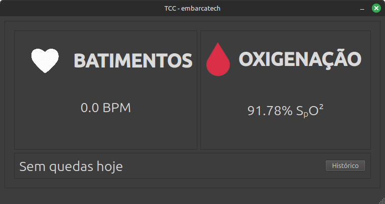
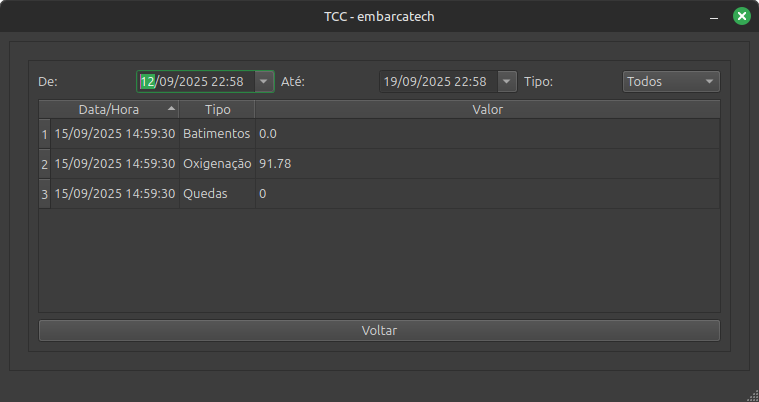
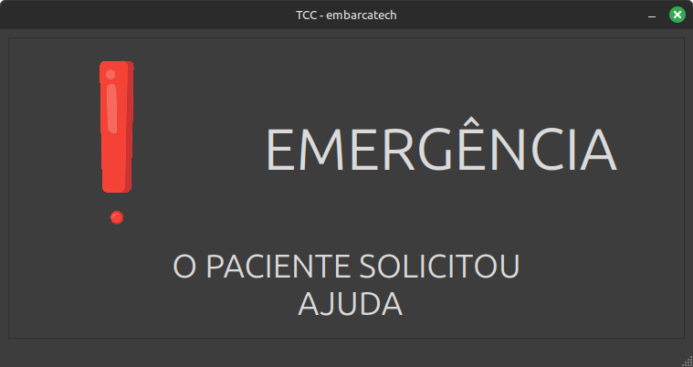
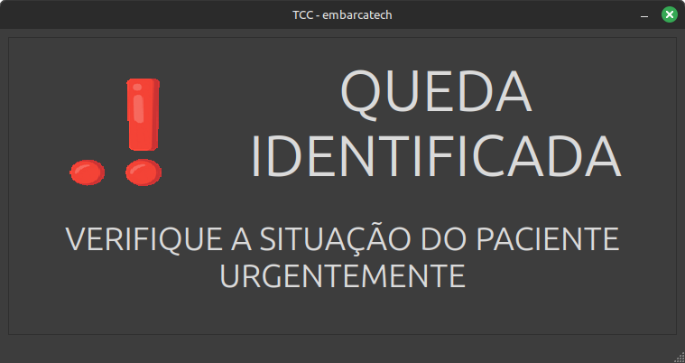

# Aplicativo para obter os dados

## Objetivo

Esta parte do projeto foi desenvolvido para **amostragem de dados**, com o objetivo de mostrar os dados coletados pelo hardware "vestível" e os alertas relacionados ao sistema.

A proposta é criar um aplicativo que seria **utilizado pelo médico**, fornecendo um sistema capaz de:

- 📡 **Receber os dados em tempo real** permitindo que o médico responsável acompanhe o paciente
- ❤️ **Mostrar as medidas de batimentos cardíacos e SpO2** (oximetria)
- 🔔 **Gerar notificações de emergência** de forma simples e acessível ao usuário

---

## Telas







## 

## 💻 Como Reutilizar o Código / Executar o Projeto

### Requisitos

- **Python** (versão 3.9 ou superior)
- **PySide6**
- VSCode ou outro editor de código de sua preferência
- Bibliotecas listadas no `requirements.txt`

---

### Passos

1. Clone este repositório:

   ```bash
   git clone https://github.com/EmbarcaTech-2025/projeto-final-felipe_vitor.git
   ```

2. Abra a pasta do projeto do aplicativo no VSCode.

3. Abra um novo terminal no diretório raiz do projeto (a pasta clonada/descompactada).

4. Crie um ambiente virtual:
   ```bash
   python3 -m venv venv
   ```
5. Ative o ambiente virtual:

   - **Windows**:

     ```cmd
     .\venv\Scripts\Activate
     ```

     ou

     ```cmd
     venv\Scripts\activate.bat
     ```

   - **Linux / macOS**:
     ```bash
     source venv/bin/activate
     ```

   Quando ativado, deve aparecer `(venv)` no início da linha do terminal.

6. Instale as dependências:
   ```bash
   pip install -r requirements.txt
   ```

---

### ➤ Executando Componentes do Projeto

7. Para rodar a parte de leitura do MQTT, que atualiza o arquivo `dados.csv`:

   ```bash
   python3 mqtt.py
   ```

8. Para iniciar a interface gráfica principal:

   ```bash
   python3 main.py
   ```
